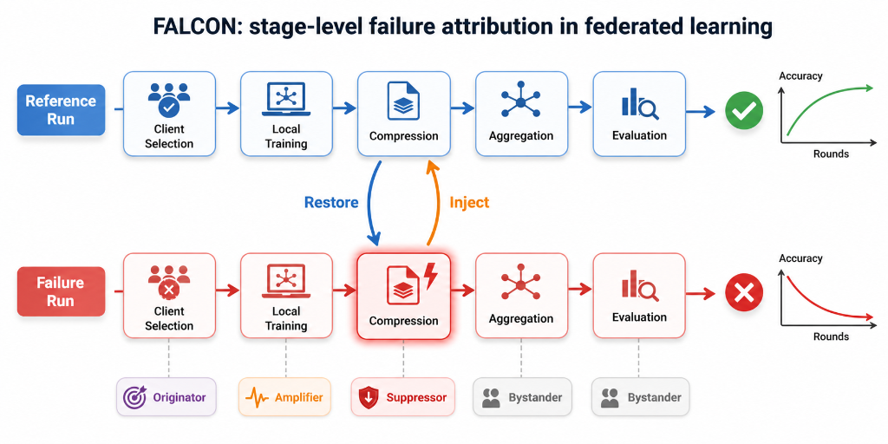
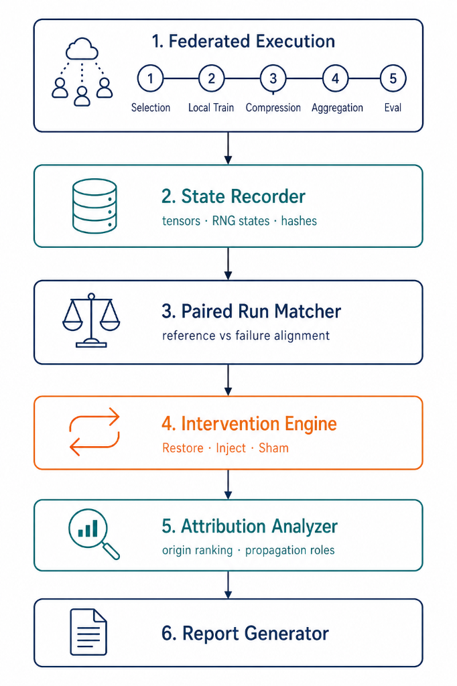

# FALCON (working name)

**Failure Attribution and Localized Causal Interventions in Federated Learning.**



Localizes *where* an FL pipeline first fails (Selection → Local Training → Compression → Aggregation → Evaluation) by recording stage-level states in matched reference/failure run pairs and performing Restore / Inject / Sham interventions. Terminal metrics tell you *that* a run failed; FALCON separates the **originator** stage from downstream **amplifiers**, **suppressors**, and **bystanders**.

Full research plan: [Plan.md](Plan.md). Stage interface contract: [docs/CONTRACTS.md](docs/CONTRACTS.md).

> The name FALCON collides with an ICSE 2025 fault-localization paper and is **internal-only** until renamed (Plan.md §2.2). Do not publish this repo under this name.

## Setup (both machines)

Conda (recommended):

```bash
conda env create -f environment.yml
conda activate falcon
pytest   # smoke check
```

Or plain venv:

```bash
python -m venv .venv
# Windows: .venv\Scripts\activate    Linux/mac: source .venv/bin/activate
pip install -e ".[dev]"
pytest
```

GPU note: `environment.yml` installs default (CPU) PyTorch — enough for the numpy-only MVP. Swap in a CUDA build per machine when Tier 1 (CIFAR) experiments start.

## Datasets (per machine)

Dataset location is resolved by `falcon/data_paths.py`: `FALCON_DATA_ROOT` env var if set, else `./data`.

- **Machine with an existing torchvision root** (e.g. `D:\pythondata\torch data`):
  `setx FALCON_DATA_ROOT "D:\pythondata\torch data"` — nothing is re-downloaded.
- **Fresh machine (co-author):** set nothing. `python scripts/prepare_data.py --datasets cifar10,cifar100,mnist,fmnist,svhn` downloads into `./data` and exports standardized pickles to `./data/processed/<name>.pkl` (keys: `x_train,y_train,x_test,y_test`).

The FL pipeline (Tier 1+) reads only the processed pickles, so both machines run identical code.

Exact dependency versions will be pinned (lockfile) once the MVP stabilizes — before any paper-facing experiment.

## Architecture

<p align="center">
  
</p>

## Layout

```
configs/        experiment / failure / intervention configs (YAML)
falcon/schema/       typed state & run schemas (pydantic)
falcon/recorder/     stage-boundary state recorder
falcon/matcher/      reference/failure pair validation
falcon/replay/       full / stage / suffix replay
falcon/intervention/ restore / inject / sham engine
falcon/failures/     failure injectors per stage
falcon/attribution/  SRE/SIE/BIS metrics, origin ranking
falcon/reporting/    attribution reports
experiments/    experiment entry scripts
tests/          unit / integration / replay / intervention tests
docs/tasks/     developer task specs (PM → Codex/Kimi)
```

## Workflow

- PM (Claude) writes task specs in `docs/tasks/`, reviews and integrates.
- Developers (Codex, Kimi) implement against `docs/CONTRACTS.md`.
- Never run paper experiments outside a committed config + seed.
